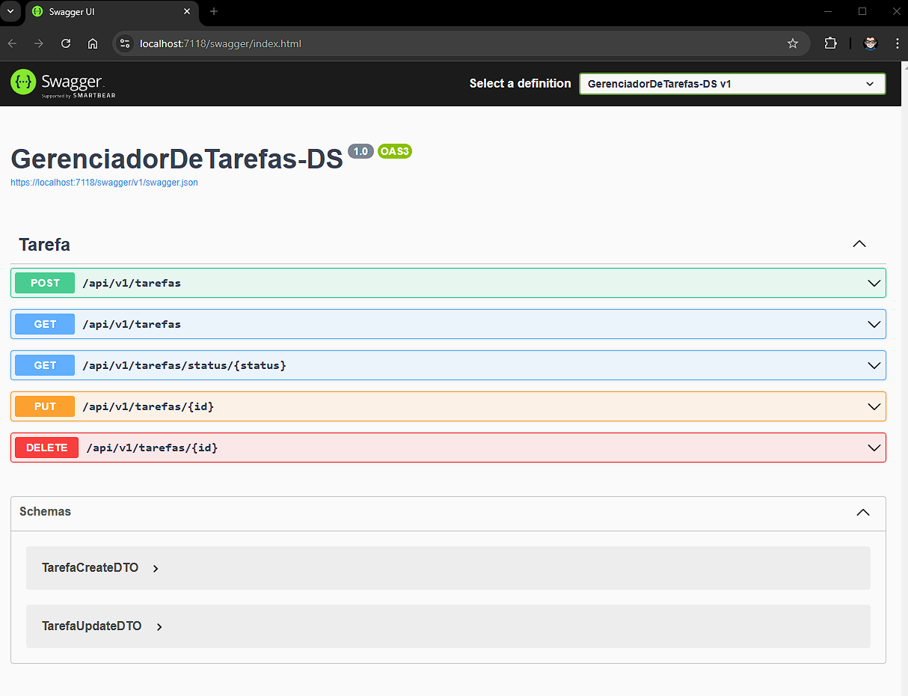

# Gerenciador de Tarefas (TODO) 

## Descrição
Este projeto é uma API de Gerenciamento de tarefas com as operações de CRUD

## Funcionalidades

 - Criar uma nova tarefas
 - Carregar todas as tarefas
 - Filtrar tarefas por status
 - Atualizar uma tarefa existente
 - Deletar uma tarefa

## Tecnologias / Requisitos
  - ASP.NET Core 6
  - EntityFramework 7
  - SQL Server

## Execução/Configuração do Projeto
 - SQLServer
   - Crie um banco de sua escolha
 - VisualStudio
   - Projeto foi criado e executado no VisualStudio 2022
   - Faça o clone do projeto e abra o mesmo no VisualStudio
   - Em seguida vá no arquivo de configuração **appsettings.json** e mude as configurações para acessar o seu banco recem criado na string **DefaultConnection**
        ```bash
        "DefaultConnection": "Server=localhost,1433;Database=trocar_banco;User ID=sa;Password=12345678;Trusted_Connection=False;TrustServerCertificate=True;" 

   - Vá no menu Ferramentas -> Gerenciador de pacotes do NuGet -> Console do Gerenciador de pacotes do NuGet
   - Com esse console  aberto execute o seguinte comando para criar a estrutura inicial do banco com uma migration pré configurada no projeto ***Update-Database***
   - **OBS**: Caso o comando acima não funcione será necessario criar a tabela diretamente no banco atraves do script abaixo:
        ```bash
        CREATE TABLE tarefas (
            id INT IDENTITY(1,1) PRIMARY KEY,
            titulo NVARCHAR(100) NOT NULL,
            descricao NVARCHAR(MAX) NULL,
            datacriacao DATETIME DEFAULT GETDATE(),
            dataconclusao DATETIME NULL,
            status NVARCHAR(50) NOT NULL
        );

## Screenshots


